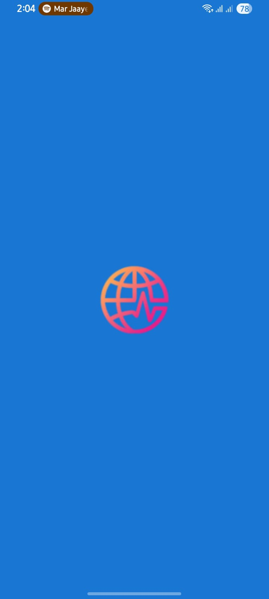
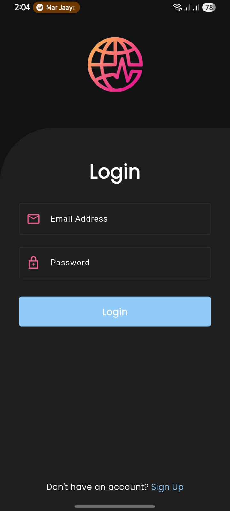
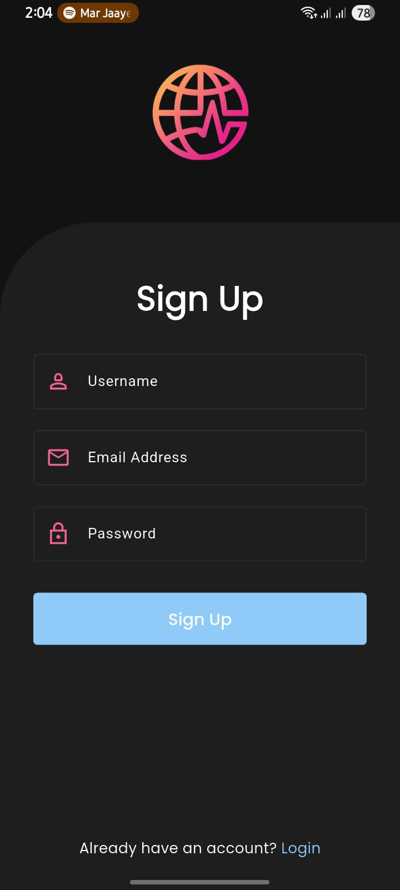
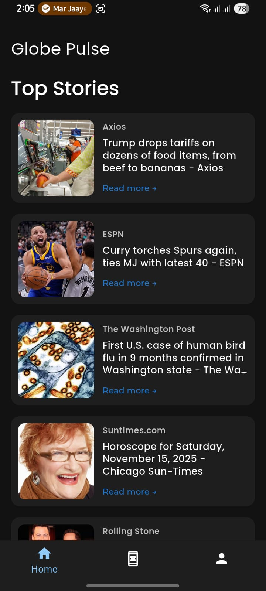
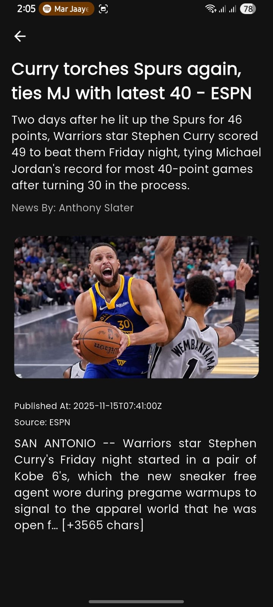
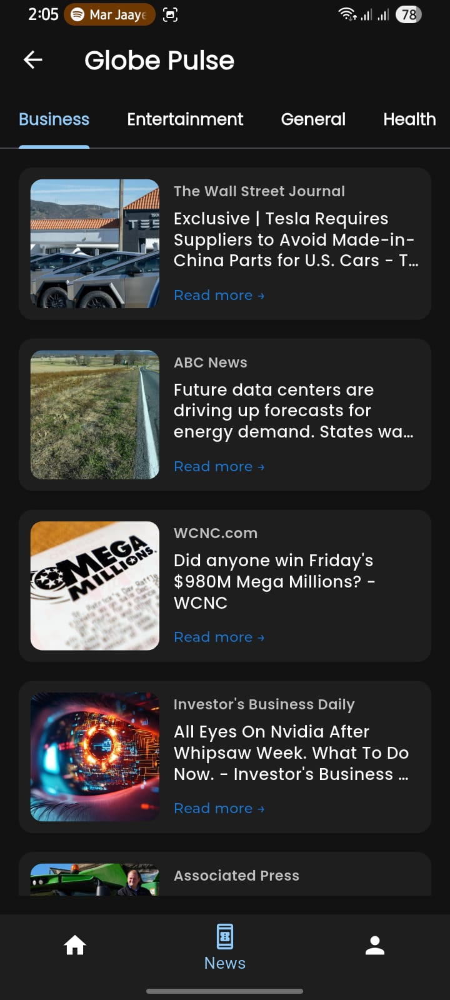
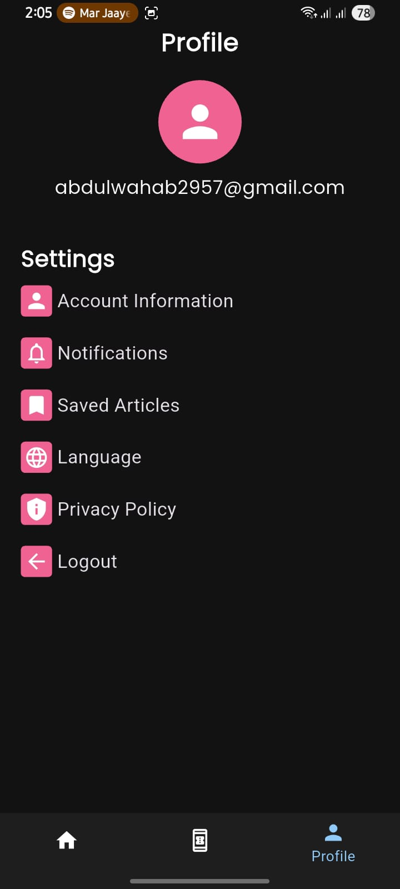

# 📰 Globe Pulse – Flutter News App

## 🚀 Overview

Globe Pulse is a modern, elegant, and fast Flutter news application.
It delivers real-time global news updates with a clean UI, intuitive 
navigation, giving users the power to stay informed anywhere, anytime.

## ✨ Features

- **Real-time News Fetching:** Stay updated with the latest headlines from across the world.
- **Category-based Browsing:** Explore news by topics (Technology, Sports, Business, Health, etc.).
- **Beautiful UI/UX:** Built with consistent typography, custom colors, and a sleek layout.
- **Firebase Authentication:** Secure user login and signup.
- **Native Splash Screens:** Seamless loading experience.
- **Bottom Navigation Bar:** Easy access to Home, News, and Profile sections.
- **Custom Reusable Widgets:** Clean and maintainable code design.

## 🧱 Tech Stack

**Framework:** Flutter

**Programming Language:** Dart

**Backend/Database:** Firebase

**Design:** Material Design 3

**IDE:** Android Studio

## 📂 Project Structure
<pre>  <code>
lib/
├── api_services/
    ├── api_url.dart
    ├── get_api.dart
├── models/
    ├── api_models/
        ├── business_headlines.dart
        ├── entertainment_headlines.dart
        ├── general_headlines.dart
        ├── health_headines.dart
        ├── sports_headlines.dart
        ├── technology_headlines.dart
        ├── top_headlines.dart
├── utils/
    ├── constants/
        ├── app_colors.dart
        ├── typography.dart
    ├── routes/
        ├── routes.dart
        ├── routes_names.dart
    ├── theme/
        ├── theme.dart
    ├── ui_helper/
        ├── custom_form_field.dart
        ├── custom_toast.dart
        ├── customButtons.dart
        ├── news_card.dart
        ├── profile_card.dart
├── views/
    ├── news_category_view/
        ├── business_headlines.dart
        ├── entertainment_headlines.dart
        ├── general_headlines.dart
        ├── health_headines.dart
        ├── sports_headlines.dart
        ├── technology_headlines.dart
    ├── bottom_nav_bar.dart
    ├── detailed_news.dart
    ├── home_view.dart
    ├── news_view.dart
    ├── profile_view.dart
    ├── signIn_view.dart
    ├── signUp_view.dart
    ├── splash_view.dart
    </code> </pre>
## 🎨 UI Highlights
- 🧭 Modern Bottom Navigation Bar
- 💬 Clean Typography System
## 📸 App Preview

  
  
  
  
  
  
    

## 🧑‍💻 Developed by

Abdul Wahab | Flutter Developer 

